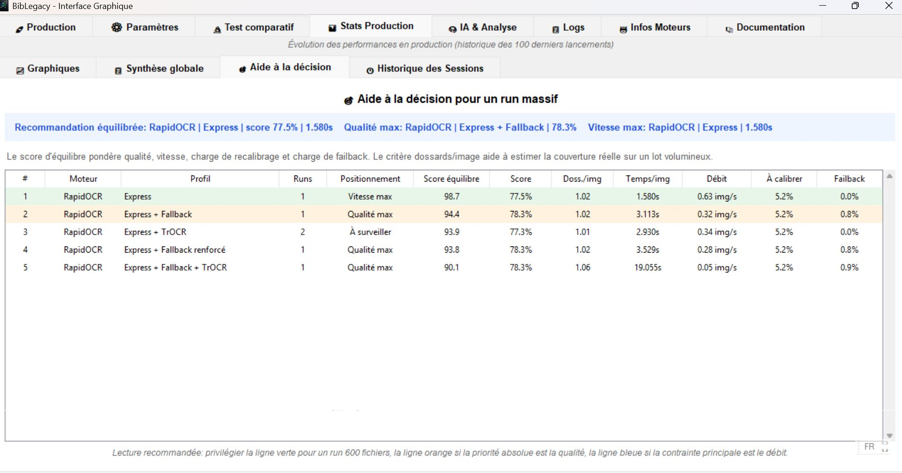

# Captures d ecran

Cette section presente quelques vues reelles de l application BibLegacy.

## Ecran d aide

L ecran d aide sert de point d entree pour les explications operateur et les reperes de navigation.

## Ecran de production

Cet ecran concentre le workflow principal : selection du projet, verification des chemins, choix du profil puis lancement de la production OCR.

## Ecran des parametres

Cette vue permet de comprendre les options de traitement, les profils et les reglages utiles a l exploitation.