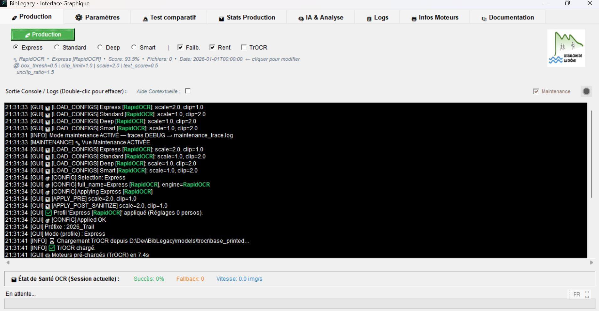
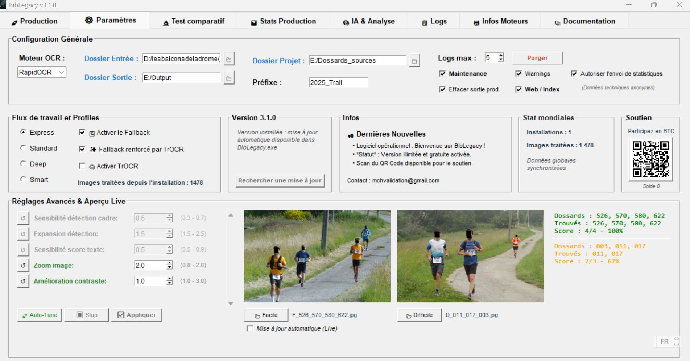

# BibLegacy

BibLegacy est une application Windows de lecture OCR de dossards, orientee exploitation terrain, calibrage et post-traitement web.

## Telechargement

- Executable Windows : [gui.zip](https://lesbalconsdeladrome.fr/BibLegacy/gui.zip)

## Ce que fait BibLegacy

- renomme automatiquement les photos a partir des dossards detectes
- propose plusieurs profils de travail : Express, Standard, Deep, Smart
- permet de comparer les profils sur un dossier de test
- aide a regler le moteur OCR sur des images reelles
- peut produire une sortie web locale pour relecture et correction

## Demarrage rapide

1. telechargez et decompressez l'executable
2. lancez `gui.exe`
3. choisissez un **Dossier Projet**
4. laissez l'application renseigner automatiquement les dossiers d'entree et de sortie
5. deposez vos propres images dans `Test_OCR`, `Calibrage` ou `Base photos` selon le besoin

## Pages utiles

- [Installation](installation.md)
- [Utilisation](utilisation.md)
- [Dossier Projet](dossier-projet.md)
- [Captures d ecran](captures.md)

## Apercu de l application

### Production

### Parametres

## Documentation technique du depot

La documentation de maintenance et les guides internes restent dans le depot principal. Cette partie MkDocs sert surtout de facade publique et operateur.
